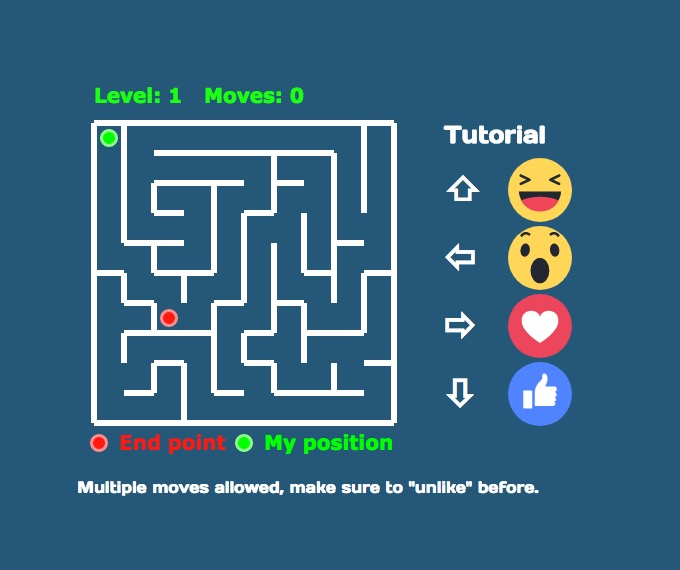

# Facebook Live Stream Game



  * Install dependencies with `mix deps.get`
  * Start endpoint with `mix phoenix.server`

Now you can visit [`localhost:4000`](http://localhost:4000) from your browser.

# Maze game texts

Facebook Live Stream Maze game, come play now!

## Setup the Chromium window

Use separate browser window

```chromium --app=http://localhost:4000/city --window-position=600,600 --incognito```

To make sure the window size is set properly use X11 tool:

```xdotool search --name "City" windowsize 1280 720```
